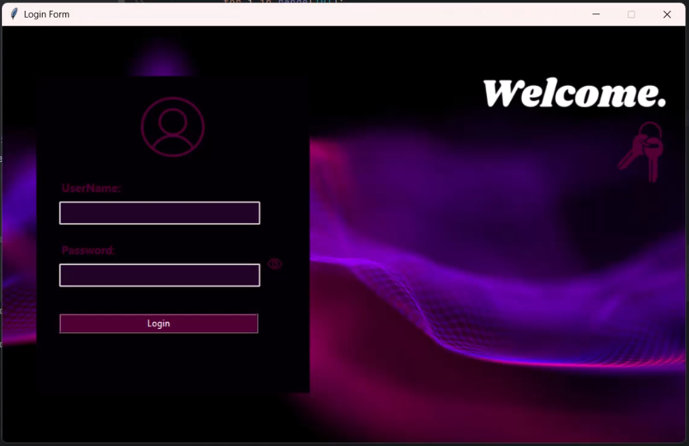
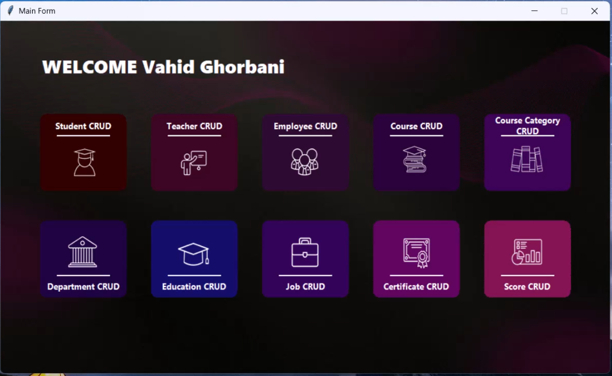

# 🎓 Educational Management System (Python & SQL)

Welcome to my repository! I am an **Economic Analyst** and Data Enthusiast transitioning my theoretical knowledge into practical, data-driven software solutions. 

This project is a comprehensive **Educational Management System** with a professional Graphical User Interface (GUI). It demonstrates a robust integration of backend relational database management with an N-Tier layered architecture (BLL, DAL, Model, UI).

## 📸 Previews

### Login System & Access Control

### Main Dashboard

## 🚀 Key Features

### 🔐 Role-Based Access Control (RBAC)
The system features a secure multi-user login environment with two distinct access levels:
- **Admin Level:** Unrestricted access to all modules, including financial data, teacher management, and system settings.
- **User Level:** Restricted access specifically tailored for student-related operations and basic data entry.

### 🗄️ Relational Database & CRUD
- **Normalized Architecture:** Seamlessly connects Students, Teachers, Employees, Courses, Departments, and Certifications.
- **Live Interaction:** Full CRUD operations with real-time search filtering across all data grids.

### 📄 Automated Document & Report Generation
- **For Students:** - Automated PDF generation for **Student ID Cards**.
  - Instant issuance of **Official Graduation Certificates** upon course completion.
- **For Staff:** - Direct printing of **Official Employment Contracts** for teachers and employees.
- **Data Portability:** - Advanced **Excel Export** functionality for all data tables, enabling further economic and statistical analysis.

## 🛠️ Technology Stack
- **Programming Language:** Python (OOP Principles)
- **GUI Framework:** Tkinter
- **Database:** SQL Server (Relational Design, T-SQL)
- **Architecture:** N-Tier Architecture for scalability and clean code.

---
💡 *Developed as a practical step in mastering data architecture and software development. Special thanks to my instructor Vahid Ghorbani and SEMATEC Institute for their exceptional guidance.*
